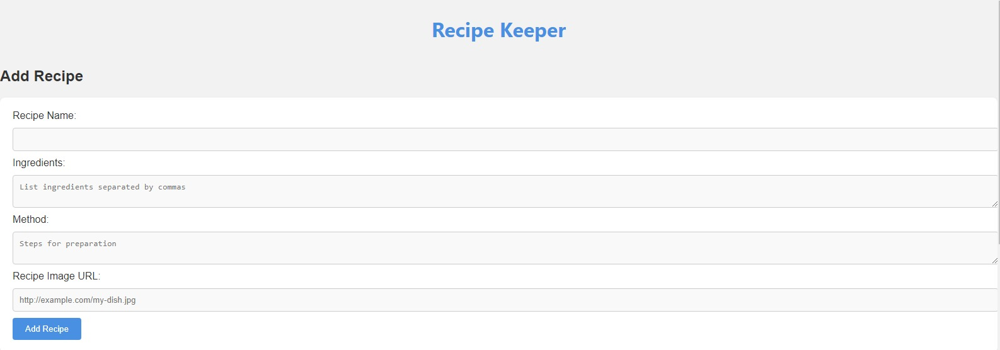
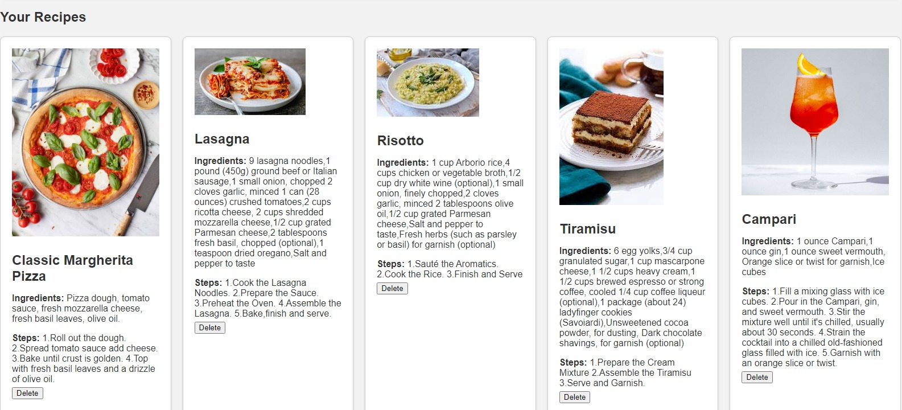

# recipe_keeper
### Nifty digital platform where you can view and manage your favorite recipes.

## Adding a Recipe
### Upon filling out the form and hitting the “Submit” button, the user’s recipe stored in recipes array, and the input fields get clear, ready for another entry.

## Displaying Recipes
### Whenever a user adds a recipe, it displays in the designated area on the page. If multiple recipes are added, each new one are listed below the previous.

## Deleting a Recipe
### Upon clicking “Delete” button next to each recipe, the corresponding recipe is removed both from the display and the recipes array.

## Adding Recipe Images
### Application to allow users to input an image URL for each recipe and display it alongside the recipe details.

## Integrating Local Storage
### local storage feature to persistently store your recipes, ensuring they remain available even after a page refresh or browser restart.

## DEMO:

